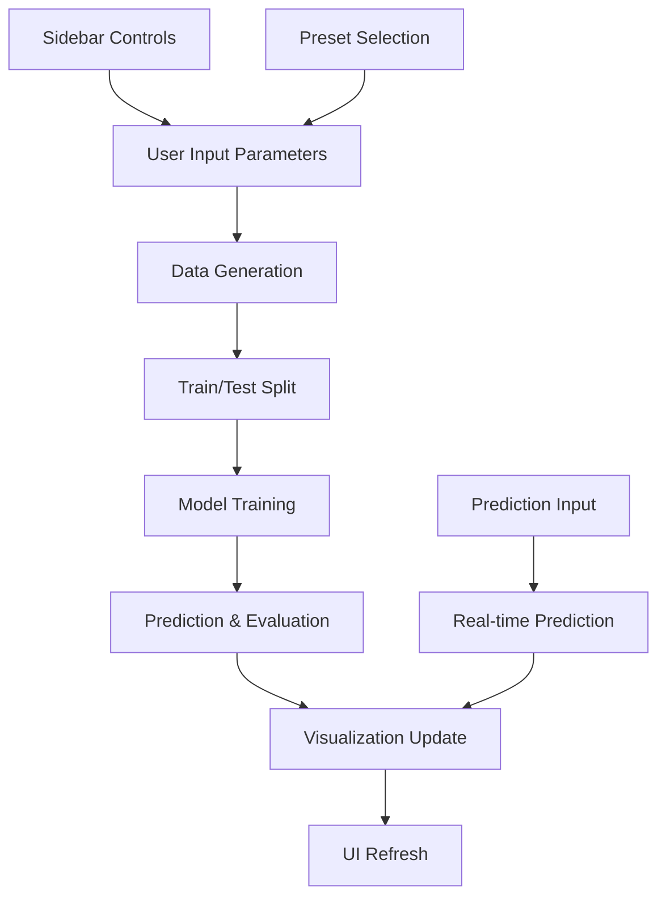

# Technical Documentation

## 📋 Project Overview

**Linear Regression Studio** is an interactive web application built with Streamlit that demonstrates simple linear regression using a modern Glassmorphism UI design. The application allows users to visualize, analyze, and interact with linear regression models in real-time.

---

## 🏗️ System Architecture

### Technology Stack
- **Frontend**: Streamlit (Python-based web framework)
- **Visualization**: Plotly (Interactive charts)
- **Machine Learning**: scikit-learn
- **Data Processing**: NumPy, Pandas
- **Styling**: Custom CSS with Glassmorphism design

### Application Structure
```
app.py
├── Main Application Logic
├── UI Components (Glassmorphism CSS)
├── Data Generation Functions
├── Machine Learning Pipeline
├── Visualization Components
└── Interactive Controls
```

---

## 🎨 Design Philosophy

### Glassmorphism UI Design
- **Semi-transparent backgrounds**: `rgba(255, 255, 255, 0.15)`
- **Backdrop blur effects**: `backdrop-filter: blur(20px)`
- **Subtle borders**: `1px solid rgba(255, 255, 255, 0.2)`
- **Dynamic gradient background**: Animated multi-color gradients
- **Glass-like elements**: Consistent transparency hierarchy

### Layout Strategy
- **Desktop-first approach**: Optimized for landscape viewing
- **Sidebar organization**: Secondary functions in collapsible sidebar
- **3:1 main layout**: Primary visualization gets majority screen space
- **Responsive design**: Scales appropriately for different screen sizes

---

## ⚙️ Core Functionality

### 1. Data Generation Engine
```python
def generate_linear_data(a=1.0, b=0.0, noise=1.0, n_points=100, random_state=None)
```
- Generates synthetic linear dataset following `y = ax + b + noise`
- Configurable parameters for slope, intercept, noise level, and sample size
- Reproducible results through random seed control

### 2. Machine Learning Pipeline
- **Training**: Uses scikit-learn's LinearRegression
- **Data Split**: 80/20 train-test split
- **Evaluation**: MSE and R² score metrics
- **Prediction**: Real-time prediction for user-input values

### 3. Interactive Visualization
- **Plotly Integration**: Interactive, zoomable, hoverable charts
- **Multi-layer Display**: Training data, test data, regression line, true line
- **Real-time Updates**: Instant chart updates on parameter changes
- **Prediction Markers**: Visual indication of prediction points

### 4. Residual Analysis
- **Residual Scatter Plot**: Predicted vs residual values
- **Distribution Histogram**: Residual value distribution analysis
- **Model Quality Assessment**: Visual indicators of model fit quality

---

## 🎛️ User Interface Components

### Sidebar Control Panel
| Component | Function | Range/Options |
|-----------|----------|---------------|
| **Preset Selector** | Quick parameter combinations | 4 predefined scenarios |
| **Slope Slider** | Linear relationship steepness | -10.0 to 10.0 |
| **Intercept Slider** | Y-axis intersection point | -20.0 to 20.0 |
| **Noise Slider** | Data scatter control | 0.0 to 10.0 |
| **Points Slider** | Dataset size | 10 to 500 points |
| **Random Seed** | Reproducibility control | Integer input |
| **Prediction Input** | Custom X value prediction | Float input |

### Main Display Area
- **Primary Chart**: Full-screen interactive visualization
- **Metric Cards**: Glassmorphism-styled performance indicators
- **Dataset Statistics**: Training/test split information
- **Equation Display**: Current regression equation

### Optional Components
- **Residual Analysis**: Toggle-able detailed model analysis
- **True Line Display**: Comparison with noise-free relationship
- **Prediction Visualization**: Real-time prediction point display

---

## 📊 Data Flow Architecture



---

## 🔧 Technical Implementation Details

### CSS Architecture
- **Modular Design**: Separate classes for different UI components
- **Variable Transparency**: Layered opacity for depth perception
- **Animation Integration**: Smooth transitions and hover effects
- **Cross-browser Compatibility**: Modern CSS features with fallbacks

### State Management
- **Session State**: Persistent parameter storage across interactions
- **Real-time Updates**: Immediate response to user input changes
- **Conditional Rendering**: Dynamic component visibility based on user preferences

### Performance Optimization
- **Efficient Recomputation**: Only regenerates data when parameters change
- **Cached Calculations**: Reuses computed values where possible
- **Optimized Rendering**: Streamlit's built-in optimization for chart updates

---

## 📈 Machine Learning Implementation

### Algorithm Choice
- **Linear Regression**: Simple, interpretable, perfect for demonstration
- **Scikit-learn Integration**: Industry-standard implementation
- **Least Squares Method**: Optimal solution for linear relationships

### Model Evaluation
```python
def evaluate(y_true, y_pred):
    mse = mean_squared_error(y_true, y_pred)
    r2 = r2_score(y_true, y_pred)
    return {'mse': mse, 'r2': r2}
```

### Metrics Explanation
- **MSE (Mean Squared Error)**: Average squared difference between predictions and actual values
- **R² Score**: Proportion of variance in dependent variable predictable from independent variable
- **Residual Analysis**: Distribution and pattern analysis of prediction errors

---

## 🌐 Deployment Architecture

### Streamlit Cloud Integration
- **GitHub Integration**: Direct deployment from repository
- **Automatic Updates**: Continuous deployment on code changes
- **Resource Management**: Optimized for cloud resource constraints
- **Public Access**: Shareable URL for demonstration purposes

### Requirements Management
```
numpy
pandas
scikit-learn
matplotlib
streamlit
plotly
```

### Configuration Files
- `requirements.txt`: Python package dependencies
- `app.py`: Main application entry point
- CSS embedded within application for styling

---

## 🔍 Code Quality & Best Practices

### Code Organization
- **Modular Functions**: Separate functions for distinct operations
- **Clear Documentation**: Comprehensive docstrings and comments
- **Consistent Naming**: Descriptive variable and function names
- **Error Handling**: Graceful handling of edge cases

### UI/UX Principles
- **Progressive Disclosure**: Advanced features hidden by default
- **Immediate Feedback**: Real-time response to user actions
- **Visual Hierarchy**: Important information prominently displayed
- **Accessibility**: High contrast, readable fonts, logical navigation

---

## 🚀 Future Enhancement Possibilities

### Advanced Features
- **Multiple Regression Algorithms**: Ridge, Lasso, Polynomial
- **Data Export**: CSV/JSON download functionality
- **Model Comparison**: Side-by-side algorithm performance
- **Animation Mode**: Parameter change animations
- **Custom Data Upload**: User-provided dataset support

### Technical Improvements
- **Performance Monitoring**: Real-time performance metrics
- **Error Logging**: Comprehensive error tracking
- **A/B Testing**: UI variant testing capabilities
- **Mobile Optimization**: Responsive design for mobile devices

---

## 📚 Dependencies & Licensing

### Core Dependencies
| Package | Version | Purpose |
|---------|---------|---------|
| streamlit | latest | Web framework |
| plotly | latest | Interactive visualization |
| scikit-learn | latest | Machine learning algorithms |
| numpy | latest | Numerical computing |
| pandas | latest | Data manipulation |

### Browser Compatibility
- **Chrome**: Full support (recommended)
- **Firefox**: Full support
- **Safari**: Full support with minor CSS limitations
- **Edge**: Full support

---

*This technical documentation provides comprehensive coverage of the Linear Regression Studio application architecture, implementation details, and design decisions.*